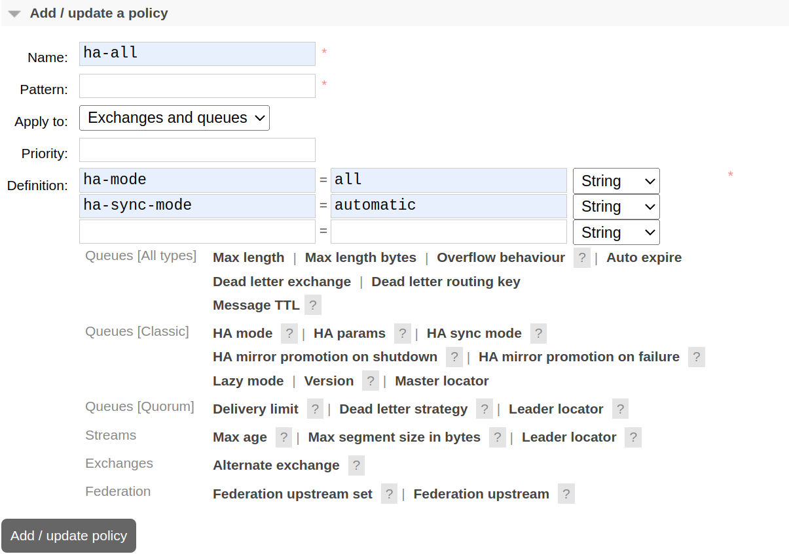

# RabbitMQ Код с лекции «Очереди RabbitMQ»


```
для запуска RabbitMQ переименуйте файл .env_example в .env и выполните:
- docker compose -f docker-compose_simple.yml up -d (если используете docker compose версии > 2)
- docker-compose - docker-compose_simple.yml up -d (если используете docker compose версии < 2)
- далее нужн овключить репликацию внутри кластера.

Включение репликации способ 1:
- открыть контейнер с мастер нодом RabbitMQ и выполнить команду:

rabbitmqctl set_policy ha-all "" '{"ha-mode":"all","ha-sync-mode":"automatic"}

Включение репликации способ 2:
- открыть браузер и зайти в веб интерфейс RabbitMQ http://localhost:15672/
- перейти на вкладку Admin>Policies
- открыть раскрывающийся блок Add / update a policy и заполнить его как на картинке ниже:
```


```
- нажать кнопку add / update policiy. 


- после выполнения настройки репликиции любым из спопобов на вкладке Exchanges можно убедиться что в колонке Features отображается политика ha-all как на рисунке ниже. 
```


```
RabbitMQ сконфигруированый для работы в режиме репликации можно запустить с помощью docker-compose.yml

- docker compose up -d 

```


```
для запуска примеров из директории ./demo:
- cd demo
- python3 -m venv env
- source ./env/bin/activate
- pip install -r requirements.txt

- python consumer.py   - запуск консьюмера
- python producer_single.py    - запуск продюссера для отправки одного сообщения
- python producer.py     - запуск продюссера для отправки потока сообщений

```


```
команды rabbitmqctl
пользователи:
rabbitmqctl list_users
rabbitmqctl add_user test test
rabbitmqctl set_user_tags test administrator
rabbitmqctl set_permissions -p / test ".*" ".*" ".*"

политика репликации:
rabbitmqctl set_policy ha-all "" '{"ha-mode":"all","ha-sync-mode":"automatic"}'
```
# Вопросы к кластеру

* image: rabbitmq:3.10.7-management не смог запустить даже отдельным Docker контейнером. Вернее он запускается, но к web интерфейсу подключиться невозможно. При запуске часто ловил внизу экрана на оранжевом фоне белыми буквами ошибку **undefined: There is no template at js/tmpl/login.ejs undefined**
* Без плагина rabbitmq_peer_discovery_classic_config кластер не собирается, а автор его не указал.
* в конфигурационном файле RabbitMQ нельзя использовать настройку management.load_definitions, так как её RabbitMQ не распознаёт и при попытке загрузить конфигурацию сервер падает. Правильная настройка - load_definitions.
